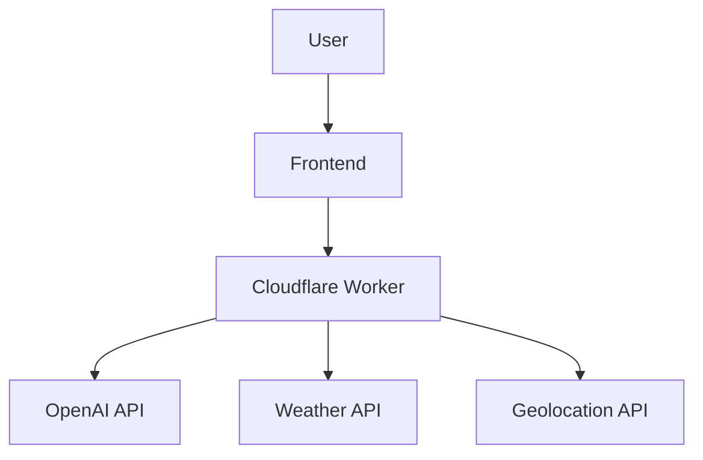

# GeoBot 🌍🤖

A smart conversational AI assistant with weather forecasting and location awareness capabilities, powered by Cloudflare Workers and OpenAI.

## Try It Out! 🚀  

🔗 **Backend Repository:** [GeoBot Backend](https://github.com/IsmailR16/GeoBot-Backend) 

## Features

- **🌦️ 3-Day Weather Forecasts**  
  Get detailed weather predictions including temperature ranges and conditions
- **📍 Automatic Location Detection**  
  Receive location-based suggestions using IP geolocation
- **🗣️ Conversational Interface**  
  Maintains context-aware discussions with chat history
- **🧠 Smart Activity Suggestions**  
  Get personalized recommendations based on local weather
- **🔒 Privacy-First**  
  No permanent data storage - sessions reset on browser close

## How It Works

### Architecture

### Key Components
- **Conversation Engine**  
  Uses GPT-3.5-turbo with function calling for natural interactions
- **Weather System**  
  Integrates OpenWeatherMap for accurate forecasts
- **Location Service**  
  Combines Cloudflare headers and ipinfo.io API
- **Session Memory**  
  Maintains context using browser sessionStorage

## Installation

### Requirements
- Cloudflare account
- OpenAI API key
- OpenWeatherMap API key
- ipinfo.io API token

## Technologies Used
- 🛡️ Cloudflare Workers
- 🧠 OpenAI GPT-3.5-turbo
- 🌤️ OpenWeatherMap API
- 📍 ipinfo.io Geolocation

## Example Prompts
- "What do you suggest I do today/tomorrow?"
- "What will the weather be today in my location?"
- "Give me a three-day forecast for my city."
- "How should I dress for today's weather?"

**Note:** This project is a demonstration of AI integration with serverless architecture. Not intended for production use without proper validation and error handling.

